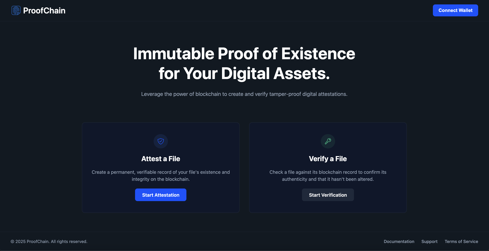

# ProofChain

**Live Demo:** [**https://proofchain-9c0.pages.dev/**](https://proofchain-9c0.pages.dev/)

ProofChain is a decentralized application (DApp) that allows users to calculate a unique digital fingerprint (hash) for any digital file and permanently record this fingerprint, along with a timestamp, on a public blockchain.

This "attestation" process creates an immutable record, enabling anyone to verify the file's state at a specific time in the future—all without needing to upload the file itself or reveal its contents.

## Core Features

- **File Attestation:** Create a permanent, timestamped proof-of-existence for any file on the blockchain.
- **File Verification:** Check if a file has been previously attested and retrieve its original timestamp and owner's address.
- **Local-First Processing:** Files are never uploaded. All hashing is done locally in the user's browser, ensuring complete privacy.
- **Web3 Integration:** Connects to Web3 wallets like MetaMask for smart contract interaction.
- **Decentralized:** Built on a public blockchain, ensuring data is tamper-proof and not controlled by any single entity.

## How It Works

### 1. Attestation Flow

1.  Navigate to the **"Attest"** page.
2.  Drag and drop or select a file.
3.  The app locally computes the file's `SHA-256` hash in your browser.
4.  Click **"Attest"** and confirm the transaction in your wallet to write this hash to the blockchain.

### 2. Verification Flow

1.  Navigate to the **"Verify"** page.
2.  Drag and drop or select the file you want to check.
3.  The app locally computes its hash.
4.  Click **"Verify"** to query the blockchain.
5.  You will be redirected to a results page showing "Verification Successful" (with the timestamp and owner) or "Verification Failed" (if the record is not found).

## Tech Stack

- **Frontend:** [React](https://reactjs.org/) (with Hooks and Context API)
- **Blockchain Interaction:** [Ethers.js](https://ethers.io/)
- **Routing:** [React Router](https://reactrouter.com/)
- **Styling:** CSS
- **Icons:** [React Icons](https://react-icons.github.io/react-icons/)
- **Smart Contract:** [Solidity](https://soliditylang.org/) (Deployed on Sepolia Testnet)

## Future Roadmap

- [ ] Implement **Multi-Party Attestation:** Integrate digital identity (e.g., DIDs or multi-sig) to allow two or more parties to co-attest a single file hash. This will cryptographically prove mutual agreement on a specific document version, resolving potential disputes over contract versions.
- [ ] Integrate an AI feature to analyze legal contracts and provide suggestions before attestation.
